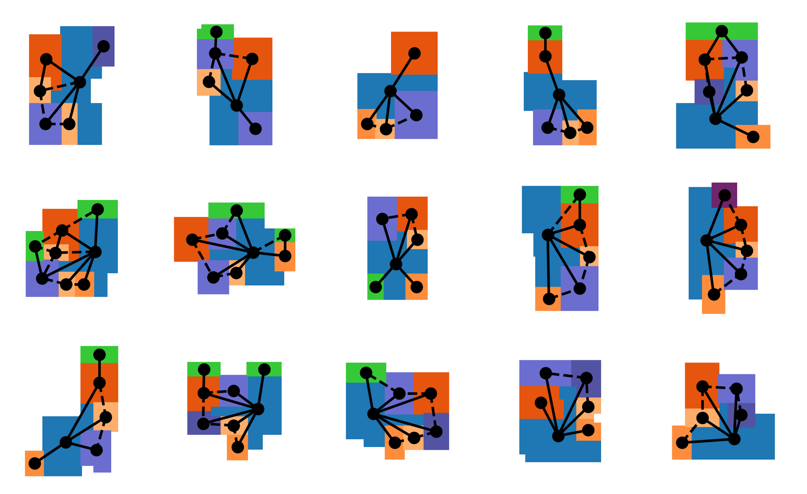

# SSIG: A Visually-guided Graph Edit Distance for Floor Plan Similarity

This repository contains code to accompany the following paper:

[**SSIG: A Visually-Guided Graph Edit Distance for Floor Plan Similarity**](https://openaccess.thecvf.com/content/ICCV2023W/CVAAD/html/van_Engelenburg_SSIG_A_Visually-Guided_Graph_Edit_Distance_for_Floor_Plan_Similarity_ICCVW_2023_paper.html)  
[Casper C. J. van Engelenburg](https://www.tudelft.nl/staff/c.c.j.vanengelenburg/?cHash=a72f1da92639fa8301893a08d4b49da1)
[Seyran Khademi](https://www.tudelft.nl/ewi/over-de-faculteit/afdelingen/intelligent-systems/pattern-recognition-bioinformatics/computer-vision-lab/people/seyran-khademi), 
[Jan C. van Gemert](https://www.tudelft.nl/ewi/over-de-faculteit/afdelingen/intelligent-systems/pattern-recognition-bioinformatics/computer-vision-lab/people/jan-van-gemert)  
Proceedings of the IEEE/CVF International Conference on Computer Vision (ICCV) Workshops, 2023, pp. 1573-1582

## Abstract

*We propose a simple yet effective metric that measures structural similarity between visual instances of architectural floor plans, without the need for learning. 
Qualitatively, our experiments show that the retrieval results are similar to deeply learned methods. 
Effectively comparing instances of floor plan data is paramount to the success of machine understanding of floor plan data, including the assessment of floor plan generative models and floor plan recommendation systems. 
Comparing visual floor plan images goes beyond a sole pixel-wise visual examination and is crucially about similarities and differences in the shapes and relations between subdivisions that compose the layout. 
Currently, deep metric learning approaches are used to learn a pair-wise vector representation space that closely mimics the structural similarity, in which the models are trained on similarity labels that are obtained by Intersection-over-Union (IoU). 
To compensate for the lack of structural awareness in IoU, graph-based approaches such as Graph Matching Networks (GMNs) are used, which require pairwise inference for comparing data instances, making GMNs less practical for retrieval applications. 
In this paper, an effective evaluation metric for judging the structural similarity of floor plans, coined **SSIG** (Structural Similarity by IoU and GED), is proposed based on both image and graph distances. 
In addition, an efficient algorithm is developed that uses SSIG to rank a large-scale floor plan database. 
Code will be openly available.*

## Layman's motivation of our research

I will try to tell our story - every act in science is a story in a way - in a simple and understandable way, with the goal to make it easier for you to understand _why_ we did the research, _what_ we did in it, and _how_ we did it.

We do research on **floor plan data**. Floor plans are two-dimensional layouts that describe the arrangements of rooms of a particular floor in a building: 

In this research we focussed on single-apartment

## Repository structure

## Code use guidelines
