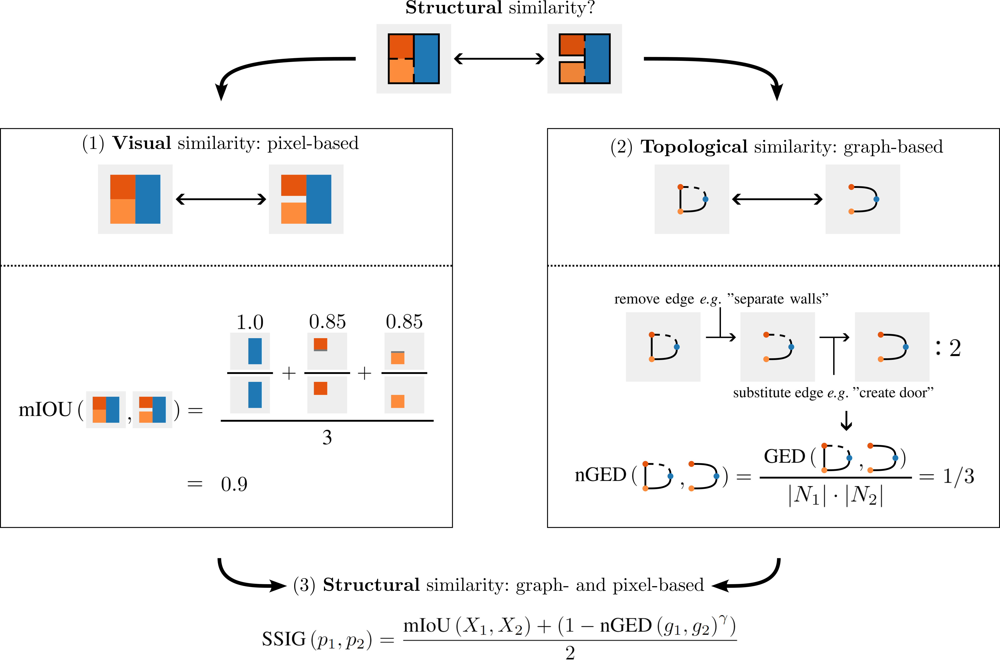
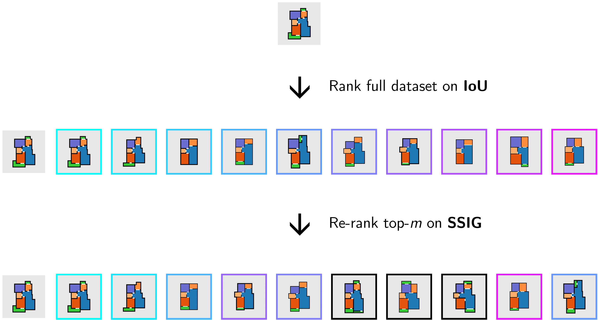

# SSIG: A Visually-guided Graph Edit Distance for Floor Plan Similarity

This repository contains code to accompany the following paper:

[**SSIG: A Visually-Guided Graph Edit Distance for Floor Plan Similarity**](https://openaccess.thecvf.com/content/ICCV2023W/CVAAD/html/van_Engelenburg_SSIG_A_Visually-Guided_Graph_Edit_Distance_for_Floor_Plan_Similarity_ICCVW_2023_paper.html)  
[Casper C. J. van Engelenburg](https://www.tudelft.nl/staff/c.c.j.vanengelenburg/?cHash=a72f1da92639fa8301893a08d4b49da1)
[Seyran Khademi](https://www.tudelft.nl/ewi/over-de-faculteit/afdelingen/intelligent-systems/pattern-recognition-bioinformatics/computer-vision-lab/people/seyran-khademi), 
[Jan C. van Gemert](https://www.tudelft.nl/ewi/over-de-faculteit/afdelingen/intelligent-systems/pattern-recognition-bioinformatics/computer-vision-lab/people/jan-van-gemert)  
Proceedings of the IEEE/CVF International Conference on Computer Vision (ICCV) Workshops, 2023, pp. 1573-1582

- [x] add proper title
- [x] add paper and citation
- [x] add links to paper and people
- [ ] re-structure README to make it easier to read through

## Abstract

*We propose a simple yet effective metric that measures structural similarity between visual instances of architectural floor plans, without the need for learning. 
Qualitatively, our experiments show that the retrieval results are similar to deeply learned methods. 
Effectively comparing instances of floor plan data is paramount to the success of machine understanding of floor plan data, including the assessment of floor plan generative models and floor plan recommendation systems. 
Comparing visual floor plan images goes beyond a sole pixel-wise visual examination and is crucially about similarities and differences in the shapes and relations between subdivisions that compose the layout. 
Currently, deep metric learning approaches are used to learn a pair-wise vector representation space that closely mimics the structural similarity, in which the models are trained on similarity labels that are obtained by Intersection-over-Union (IoU). 
To compensate for the lack of structural awareness in IoU, graph-based approaches such as Graph Matching Networks (GMNs) are used, which require pairwise inference for comparing data instances, making GMNs less practical for retrieval applications. 
In this paper, an effective evaluation metric for judging the structural similarity of floor plans, coined **SSIG** (Structural Similarity by IoU and GED), is proposed based on both image and graph distances. 
In addition, an efficient algorithm is developed that uses SSIG to rank a large-scale floor plan database. 
Code will be openly available.*

- [x] add abstract

## Contributions

- A study on the distributions and correlations between IoU and GED on a large-scale floor plan database, with one main finding: IoU and GED independently fail to robustly capture structural similarity.
- A proposed simple yet powerful measure for the structural similarity of floor plans.
- An effective ranking technique to sort a large floor plan database, hence developing a starting point for proper evaluation and training of floor plan retrieval models.

- [x] add contributions

## Layman's summary of our work

Generally speaking, the ability to precisely - and efficiently - compare instances of data is one of the most essential ingredients to the success of machine understanding. 
We investigate in our research how *structural* similarity between floor plans is computed / used in recent state-of-the-art works on, primarily data-driven, floor plan generation and/or analysis.
Surprisingly, previous works either use pixel- (*e.g.* Intersection-over-Union, IoU) *or* graph-based (*e.g.* a graph-edit distance, GED) similarity metrics to estimate (dis)similarity between floor plans. 
We show that IoU and GED lead to often completely different rankings: in over 38% of randomly sampled floor plan triplets, IoU and GED oppose each other. 
Opposition here means that an increase in IoU does not lead to a decrease in GED. 
Hence, we propose to measure structural similarity as a weighted sum between IoU and GED (see figure below), referred to as **SSIG**. 
A key limitation of computing **SSIG** is, however, that GED is compute heavy. 
Interestingly though, we found that nearly all best matches on **SSIG** for a given floor plan can be found in a reasonably small subset - namely the subset (50 samples orso) that contains the best matches on IoU.
Ranking can, thus, be drastically speed-up by first sampling the best matches on IoU and subsequently *re-ranking* these temporarily best matches on **SSIG**.
It is therefore, that we refer to the ranking algorithm as a visually-guided graph-edit distance.

Here is a visual on how to compute **SSIG**:

Here is how to rank using a visually-guided GED:

- [x] add structure
- [x] add ssig image
- [x] add ranking image
- [x] write

## Repository structure

The repository consists of the following folders, Python scripts, and Jupyter notebooks:

- [data](data): _folder_ that contains:
  - [valid IDs](data/valid_ids.pickle): _pickle file_ that contains a list of floor plan identifiers (IDs) that we use in our research. IDs originate from the [RPLAN dataset](http://staff.ustc.edu.cn/~fuxm/projects/DeepLayout/index.html), which can be downloaded [here](https://docs.google.com/forms/d/e/1FAIpQLSfwteilXzURRKDI5QopWCyOGkeb_CFFbRwtQ0SOPhEg0KGSfw/viewform).
  - [graphs](data/graphs.pickle): _pickle file_ that contains a dictionary of ID-graph pairs for all IDs in [valid IDs](data/valid_ids.pickle). Graphs are extracted from the floor plan images using our own graph extraction algorithm provided in [graphs.py](rplan.py). *The graph extraction algorithm is not yet uploaded to the repository*.
- [nb_graphs.ipynb](nb_graphs.ipynb): _Notebook_ that contains information on how to extract the graphs from the floor plans. *This notebook is still to be included.*
- [nb_rplan.ipynb](nb_rplan.ipynb): _Notebook_ that contains information on how to use, manipulate, and plot the floor plans and corresponding graphs.
- [nb_ranking.ipynb](nb_ranking.ipynb): _Notebook_ that contains information on how our ranking algorithm is used.
- [metrics.py](metrics.py): _Script_ that contains all the functions to compute the metrics *e.g.* MIoU, GED, and SSIG.
- [rplan.py](rplan.py): _Script_ that contains all the functions related to the processing of RPLAN *e.g.* graph extraction algorithm. *The graph extraction algorithm is not yet uploaded to the repository*.
- [plot.py](plot.py): _Script_ that contains all the floor plan plotting functions.
- [constants.py](constants.py): _Script_ that contains often used variables *e.g.* coloring schemes, paths.
- [utils.py](utils.py): _Script_ that contains all the utility function *e.g.* loading pickle files, colorizing floor plans.

- [x] add structure
- [ ] add notebook on GED, IoU, and SSIG analysis (4.1 - 4.3 in paper)
- [ ] add notebook on SSIG analysis (4.4 in paper)
- [ ] add reproduction of LayoutGMN (4.4 in paper)

## Code use guidelines

- [ ] add structure
- [ ] write
